# Data model — portal & CMS

> Supersedes nothing. Extends the Plan 01 schema (7 tables, migrations 0000–0007)
> with what a browser-facing portal and an upload CMS actually need.
> Every table holding tenant data carries `org_id` and is RLS `ENABLE`d + `FORCE`d.

## The whole model

```mermaid
erDiagram
    ORGANIZATIONS ||--o{ MEMBERSHIPS : "has members through"
    ORGANIZATIONS ||--o{ APPS : owns
    ORGANIZATIONS ||--o{ RELEASES : owns
    ORGANIZATIONS ||--o{ ARTIFACTS : owns
    ORGANIZATIONS ||--o{ AUDIT_EVENTS : records
    ORGANIZATIONS ||--o{ INVITATIONS : issues
    ORGANIZATIONS ||--o{ SESSIONS : scopes
    ORGANIZATIONS ||--o{ API_KEYS : issues
    ORGANIZATIONS ||--o{ DEVICES : registers
    ORGANIZATIONS ||--o{ INSTALL_EVENTS : records

    USERS ||--o{ MEMBERSHIPS : "belongs through"
    USERS ||--o{ SESSIONS : opens
    USERS ||--o{ AUDIT_EVENTS : "acts in"
    USERS ||--o{ INVITATIONS : "invited by"
    USERS ||--o{ DEVICES : owns
    USERS ||--o{ PASSWORD_RESETS : requests

    APPS ||--o{ RELEASES : "versioned by"
    RELEASES ||--|| ARTIFACTS : "carries one"
    RELEASES ||--o{ INSTALL_EVENTS : "installed as"
    DEVICES  ||--o{ INSTALL_EVENTS : reports

    ORGANIZATIONS {
        uuid id PK
        text slug UK "globally unique, appears in URLs"
        text name
        timestamptz created_at
        timestamptz updated_at
    }

    USERS {
        uuid id PK
        text email UK "global, not per-org"
        text password_hash "argon2id"
        text display_name
        timestamptz created_at
    }

    MEMBERSHIPS {
        uuid id PK
        uuid org_id FK
        uuid user_id FK
        enum role "owner|admin|publisher|viewer"
        timestamptz created_at
    }

    APPS {
        uuid id PK
        uuid org_id FK
        text slug "unique per org"
        text name
        text description
        text category
        enum platform "android|ios|both"
        text minimum_version "forced-update floor"
        bool featured
        uuid created_by FK
    }

    RELEASES {
        uuid id PK
        uuid org_id FK
        uuid app_id FK
        enum platform "android|ios"
        text version "unique per app+platform"
        text build_number
        text min_os
        text release_notes
        enum status "draft|published|unpublished"
        timestamptz published_at
        uuid created_by FK
    }

    ARTIFACTS {
        uuid id PK
        uuid org_id FK
        uuid release_id FK
        text package_id "package name / bundle id"
        text storage_key "derived from digest, never the filename"
        text sha256 "unique per org, NEVER across orgs"
        bigint size_bytes
        text content_type
        text original_filename
    }

    AUDIT_EVENTS {
        uuid id PK
        uuid org_id FK
        uuid actor_id FK "null survives user deletion"
        text action
        text subject_type
        text subject_id
        jsonb metadata
        timestamptz created_at
    }

    SESSIONS {
        uuid id PK
        uuid org_id FK
        uuid user_id FK
        text token_hash UK "SHA-256 of the refresh token, never the token"
        uuid rotated_from FK "prior session in the chain, for reuse detection"
        timestamptz expires_at
        timestamptz revoked_at
        text revoked_reason "logout|rotated|reuse_detected|membership_removed|admin"
        text user_agent
        inet ip_address
        timestamptz created_at
        timestamptz last_used_at
    }

    INVITATIONS {
        uuid id PK
        uuid org_id FK
        citext email "invitee, may not have a user row yet"
        enum role "role granted on acceptance"
        text token_hash UK "SHA-256, never the token"
        uuid invited_by FK
        timestamptz expires_at
        timestamptz accepted_at
        uuid accepted_user_id FK
        timestamptz revoked_at
    }

    API_KEYS {
        uuid id PK
        uuid org_id FK
        text name "human label, e.g. 'GitHub Actions'"
        text prefix "first 8 chars, shown in the UI to identify it"
        text key_hash UK "argon2id of the secret"
        enum role "publisher at most — never owner/admin"
        uuid created_by FK
        timestamptz expires_at
        timestamptz last_used_at
        timestamptz revoked_at
    }

    PASSWORD_RESETS {
        uuid id PK
        uuid user_id FK
        text token_hash UK
        timestamptz expires_at
        timestamptz used_at
        timestamptz created_at
    }

    DEVICES {
        uuid id PK
        uuid org_id FK
        uuid user_id FK
        text install_id UK "client-generated, stable per install"
        enum platform "android|ios"
        text push_token
        text os_version
        text app_version
        timestamptz last_seen_at
    }

    INSTALL_EVENTS {
        uuid id PK
        uuid org_id FK
        uuid device_id FK
        uuid release_id FK
        enum outcome "started|completed|failed|cancelled"
        text failure_reason
        timestamptz created_at
    }
```

## What is new, and why each one exists

### `sessions` — the fix for a real, reproduced defect

Refresh tokens are currently stateless 30-day JWTs, and `POST /v1/auth/refresh`
is `@Public()`. **Measured against the running API on 2026-08-23:** delete a
member's `memberships` row and their existing access token is correctly refused
(403, `RolesGuard` re-reads membership per request) — but the same user's refresh
token still mints a brand new token pair, indefinitely, for the full 30 days.

Nothing is currently breached by that, because every data path goes through
`RolesGuard`. But it means:

- an offboarded employee holds a renewable credential for a month;
- "sign out" cannot invalidate anything, on any device;
- a stolen refresh token cannot be cut off;
- the first future endpoint that trusts JWT claims without re-reading membership
  turns this into an actual breach.

A portal makes all four worse, because a browser is a far easier place to steal
a token from than a device keychain.

`sessions` stores the **SHA-256 of the refresh token**, never the token. Refresh
becomes: hash the presented token → look it up → reject if missing, expired or
revoked → **rotate** (revoke the old row, insert a new one pointing at it via
`rotated_from`) → issue the new pair.

`rotated_from` gives **reuse detection**: an already-rotated token presented a
second time means someone is replaying a stolen one, so the whole chain is
revoked and the user must sign in again. This is the standard OAuth refresh
rotation rule and it is the reason to keep the chain rather than just deleting
rows.

### `invitations` — because a second member is currently impossible

`POST /v1/auth/signup` creates an org and its owner. There is no path to a second
member except `scripts/seed-member.ts` talking to the database directly. A CMS
must be able to invite one.

`email` is `citext` so `Ada@x.com` and `ada@x.com` cannot both hold pending
invites. Token is hashed like a session. Acceptance is transactional: create the
user if absent, create the membership, stamp `accepted_at` and `accepted_user_id`
— all or nothing, so a crash midway cannot leave a consumed invite with no
membership.

### `api_keys` — uploads from CI, without a human session

The whole point of the CMS is that builds enter through the API. A build server
cannot hold a password. `role` is capped at `publisher` **by a CHECK constraint,
not by convention**: a CI key that can add admins is a privilege-escalation
primitive. `prefix` is stored so the UI can say *which* key without ever holding
the secret; the secret is argon2id-hashed exactly like a password.

### `password_resets` — table stakes for a browser portal

Single-use (`used_at`), short-lived, hashed token. Deliberately its own table
rather than columns on `users`: a reset in flight is not a property of the user.

### `devices` + `install_events` — closing the loop the audit log cannot

`audit_events` records that a download ticket was *issued*. It cannot record
whether the install *succeeded*, because that happens on the device after the
bytes leave. The mobile app already tracks installs locally and already registers
for push; neither has anywhere on the server to go. These two tables give the CMS
its only honest answer to "did this build actually land?"

`install_id` is client-generated and stable per install, so reinstalling the app
produces a new device row rather than silently inheriting another one's history.

## Rules that hold across the whole model

| Rule | Enforced by |
|---|---|
| Every tenant table carries `org_id` | `rls-invariants.spec.ts`, catalog-driven |
| RLS `ENABLE` + **`FORCE`** + policy on each | same test |
| Runtime role has no `BYPASSRLS` | `infra/local/bootstrap.sql` |
| `withTenant()` is the only path to tenant data | convention + nesting guard |
| Published releases are immutable | trigger, migration 0006 |
| Artifacts are never deduped across orgs | `UNIQUE (org_id, sha256)` |
| Audit log is append-only | `REVOKE UPDATE, DELETE`, migration 0007 |
| **Secrets are stored hashed, never raw** | `sessions`, `invitations`, `api_keys`, `password_resets` |
| **Every credential table has an explicit expiry** | `expires_at NOT NULL` on all four |

The last two rows are new, and they are the reason these four tables look
repetitive: every one of them holds something that grants access, so every one of
them hashes it, expires it, and can be revoked without a deploy.

## Deliberately absent

- **Billing** (`subscriptions`, `plans`, `usage`) — Plan 04, not needed to upload an APK.
- **Ratings/reviews** — the columns exist on `apps` as denormalised aggregates and
  stay 0 until there is a source of truth. A `reviews` table without moderation is
  a liability, not a feature.
- **Per-org OIDC** — the auth boundary is isolated for it; the table is
  `org_identity_providers` when it arrives.
